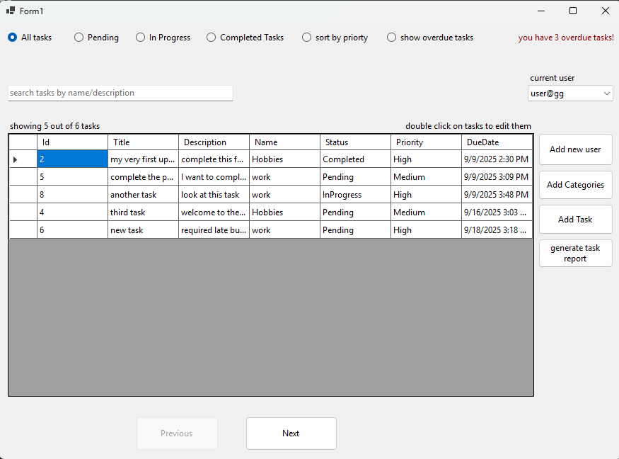
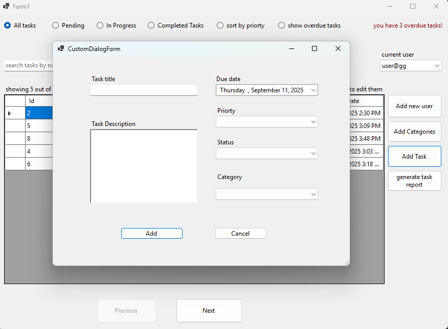
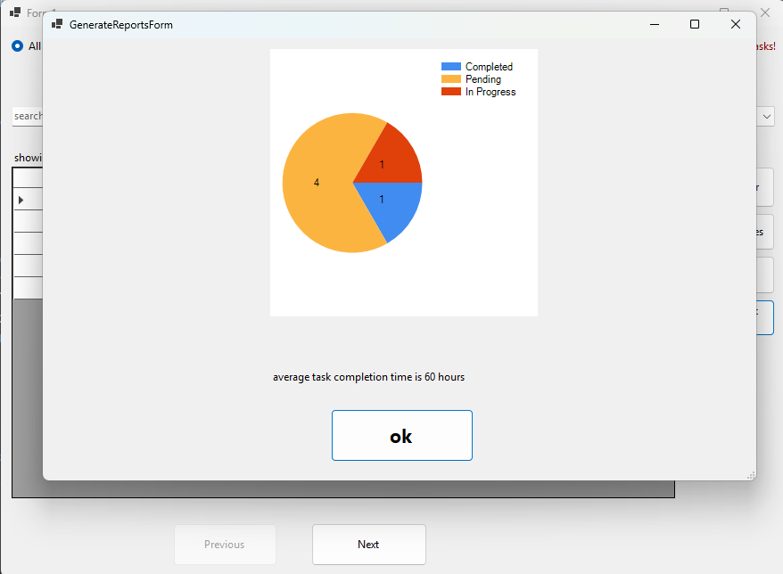

# Task Management Application  

A simple yet powerful desktop-based Task Management Application built with **C#**, **Entity Framework (Code First)**, **SQL Server**, and **Windows Forms**, featuring CRUD operations, task reporting, and multi-user support.  

---

## Features  

- **CRUD Operations**: Create, read, update, and delete tasks  
- **Task Categories**: Add and manage categories for tasks  
- **Multi-user Support**: Add multiple users and switch between them  
- **Sorting**: Sort tasks by priority or status  
- **Pagination**: Display tasks with simple pagination (5 tasks per page)  
- **Task Reporting**:  
  - Pie chart showing the ratio of completed, pending, and in-progress tasks  
  - Average task completion time calculation and display  

---

## Concepts Applied  

- C# object-oriented programming (OOP) principles  
- Entity Framework Core (Code First) database creation and manipulation  
- LINQ for data querying  
- Lazy loading in Entity Framework  

---

## Tech Stack  

- **Language**: C#  
- **IDE**: Visual Studio  
- **Database**: SQL Server  
- **UI Framework**: Windows Forms  

---

## Screenshots  

---

## Future Improvements  

- Add **user authentication and authorization**  
- Improve the UI using **WPF** or **Blazor**  
- Add **notifications/reminders** for upcoming or overdue tasks  
- Deploy the backend to the **cloud** (Azure SQL Database, Azure App Service)  
- Enhance reporting with **interactive charts and dashboards**  
- Implement **unit tests** to improve code reliability  

---

## Acknowledgments  

Special thanks to **Eng. Aya Elsharnouby** for her insightful guidance and for making complex concepts clear and accessible throughout this learning journey.  

---

## License  

This project is for educational purposes as part of the ITI .NET Development Program.  